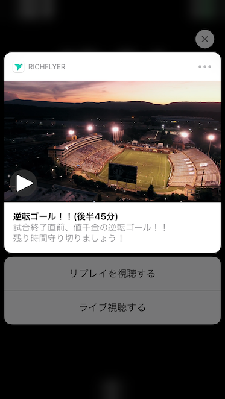
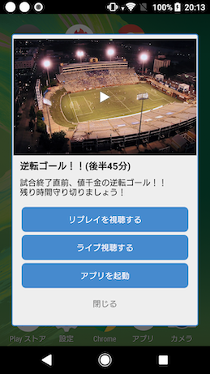

# RichFlyer Plugin for Unity

## 概要
RichFlyer Plugin for Unityは、RichFlyerサービスを利用するためにUnity向けアプリに組み込むプラグインです。 
プラグインは[Releaseページ](https://github.com/INFOCITY/richflyer-sdk-unity/releases)よりダウンロードしてください。

プラグインの詳しい説明とサンプルアプリの使用方法は、[SDKご利用ガイド](https://richflyer.net/sdk/manual/unity/)をご覧ください。

## RichFlyerとは
RichFlyerは、モバイルプッシュ通知、ウェブプッシュ通知、TwitterなどのSNSへ同時にメッセージを配信できます。

プッシュ通知には、静止画、動画、GIFアニメーションを添付できます。
ウェブ管理画面では、マルチメディアの管理もできるため簡単にリッチなメッセージを配信できます。

機能の詳細や通知画面のサンプル動画をご覧いただきたい場合は、[公式サイト](https://richflyer.net/)をご覧ください。

<table border="0" cellspacing="0" cellpadding="1">
<tr>
<td></td>
<td></td>
</tr>
</table>